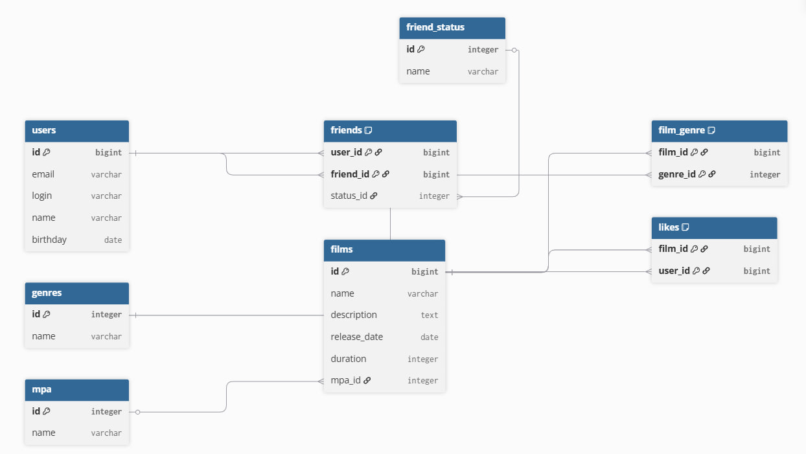

# java-filmorate
Template repository for Filmorate project.

## Схема базы данных



### Описание схемы

* Таблица *users* хранит информацию о зарегистрированных пользователях приложения. Первичным ключом является поле *id*.

* Таблица *films* содержит сведения о фильмах. Для каждого фильма сохраняются его название, описание, дата выхода, продолжительность и возрастной рейтинг. Первичным ключом является поле *id*, а поле *mpa_id* является <u>внешним</u> ключом к таблице *mpa*.

* Таблица *mpa* содержит возрастные рейтинги фильмов (G, PG, PG-13, R, NC-17). Каждая запись имеет уникальный идентификатор *id*.

* Таблица *genres* хранит список всех жанров фильмов. Первичным ключом является поле *id*.

* Таблица *film_genre* реализует связь «многие ко многим» между фильмами и жанрами. Поле *film_id* ссылается на таблицу *films*, а поле *genre_id* — на таблицу *genres*.

* Таблица *likes* хранит информацию о лайках пользователей. Один пользователь может поставить лайк нескольким фильмам, а один фильм может иметь множество лайков. Поля *film_id* и *user_id* являются <u>внешними</u> ключами к таблицам *films* и *users* соответственно.

* Таблица *friend_status* содержит возможные статусы дружбы пользователей. Например, запрос может быть **неподтверждённым** или **подтверждённым**. Первичным ключом является поле *id*.

* Таблица *friends* хранит информацию о дружбе между пользователями. Поля *user_id* и *friend_id* являются <u>внешними</u> ключами к таблице *users*, а поле *status_id* — <u>внешним</u> ключом к таблице *friend_status*. Благодаря этому можно определить текущее состояние дружбы между двумя пользователями.

### Основные запросы

Получение пользователя по id

```sql
SELECT *
FROM users
WHERE id = 1;
```

Получение фильма по id

```sql
SELECT *
FROM films
WHERE id = 1;
```

Получение друзей пользователя

```sql
SELECT u.*
FROM users u
JOIN friends f ON u.id = f.friend_id
WHERE f.user_id = 1;
```

Получение общих друзей

```sql
SELECT u.*
FROM users u
JOIN friends f1 ON u.id = f1.friend_id
JOIN friends f2 ON u.id = f2.friend_id
WHERE f1.user_id = 1
AND f2.user_id = 3;
```

Получение жанров фильма

```sql
SELECT g.name
FROM genres g
JOIN film_genre fg ON g.id = fg.genre_id
WHERE fg.film_id = 1;
```

Получение самых популярных фильмов

```sql
SELECT f.*
FROM films f
LEFT JOIN likes l ON f.id = l.film_id
GROUP BY f.id
ORDER BY COUNT(l.user_id) DESC
LIMIT 10;
```
